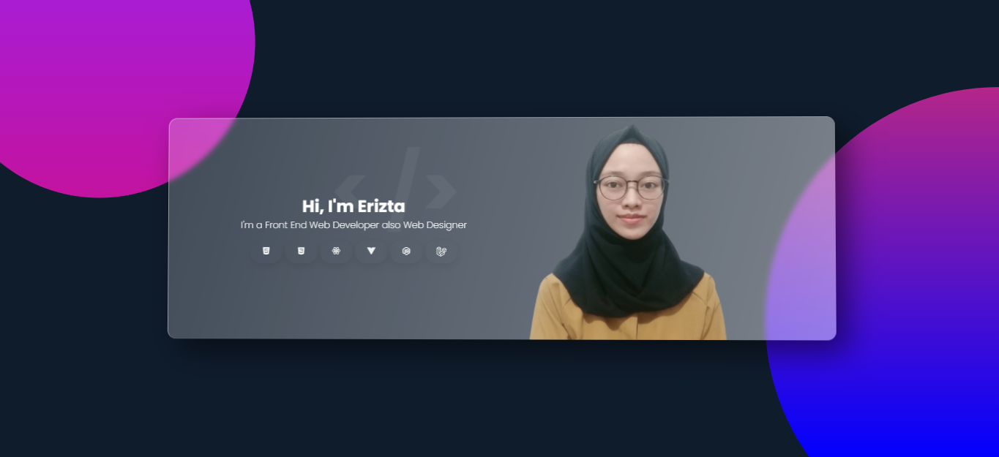

### Hi there 👋

Web Developer ✨✨

- 🌱 I've recently built web applications that delight using React JS and currently experimenting with another javascript framework. 
- ⚡ I have good sense of design 😄

## Reach me!
   [Twitter](https://twitter.com/erztfd)  
   [Facebook](https://www.facebook.com/erizta)  
   [Linked.in](http://linked.in/erizta)  
  [Gmail](mailto:eriztaalifad?subject=Let's%20Talk)

<!--
**erizta/erizta** is a ✨ _special_ ✨ repository because its `README.md` (this file) appears on your GitHub profile.

Here are some ideas to get you started:

- 🔭 I’m currently working on ...
- 🌱 I’m currently learning ...
- 👯 I’m looking to collaborate on ...
- 🤔 I’m looking for help with ...
- 💬 Ask me about ...
- 📫 How to reach me: ...
- 😄 Pronouns: ...
- ⚡ Fun fact: ...
-->
